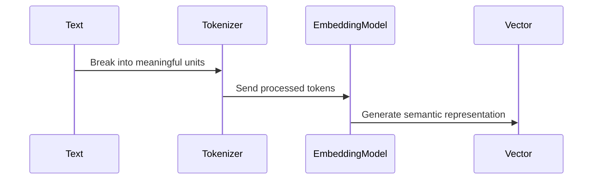

# Chapter 5: Embedding Transformation

In the [previous chapter about Repository Processing](04_repository_processing.md), we learned how to extract meaningful content from code repositories. Now, let's explore a magical process that turns this raw text into a language machines can understand: Embedding Transformation! 🌟

## The Universal Translator for Code and Text

Imagine you're a librarian trying to help people find books, but instead of using traditional card catalogs, you can instantly understand the semantic meaning of every book's content. That's exactly what embedding transformation does for digital content! 📚🔍

### What is Embedding Transformation?

Embedding Transformation is like a universal translator that converts human-readable text into a mathematical language machines can comprehend. It takes chunks of text - like code, documentation, or web content - and transforms them into dense vector representations that capture deep semantic meanings.

## Real-World Use Case: Developer Knowledge Search

Let's solve a common problem: How can developers quickly find relevant code across multiple repositories?

### The Embedding Magic

```python
def embed_chunks(chunks: List[Dict[str, Any]], embedding_function: Callable[[str], List[float]], dimension: int) -> List[Dict[str, Any]]:
    """Embed a list of text chunks."""
    # Track successful embeddings
    embedded_chunks = []
    
    # Process each chunk
    for i, chunk in enumerate(chunks):
        try:
            # Extract text from the chunk
            text = chunk.get("text", "")
            
            # Skip empty chunks
            if not text:
                logger.warning(f"Empty text in chunk {i}, skipping")
                continue
                
            # Generate embedding
            embedding = embedding_function(text)
            
            # Verify embedding dimension
            if len(embedding) != dimension:
                raise EmbeddingError(f"Embedding dimension mismatch: expected {dimension}, got {len(embedding)}")
                
            # Add embedding to chunk
            chunk_with_embedding = chunk.copy()
            chunk_with_embedding["embedding"] = embedding
            
            # Add to results
            embedded_chunks.append(chunk_with_embedding)
            
            # Log progress periodically
            if (i + 1) % 100 == 0:
                logger.info(f"Embedded {i + 1}/{len(chunks)} chunks")
                
        except EmbeddingError as e:
            logger.error(f"Error embedding chunk {i}: {e}")
            raise
        except Exception as e:
            logger.error(f"Unexpected error embedding chunk {i}: {e}")
            raise EmbeddingError(f"Unexpected error embedding chunk {i}: {e}")
    
    return embedded_chunks
```

This simple function does something incredible:
- Takes text chunks as input
- Converts each chunk into a mathematical vector
- Preserves semantic meaning in these vectors

## How Embeddings Work: A Step-by-Step Journey

Let's visualize the embedding transformation process:



### Breaking Down the Process

1. **Tokenization**: Split text into meaningful pieces
2. **Semantic Analysis**: Understand context and relationships
3. **Vector Generation**: Create a mathematical representation

## Embedding Techniques

Different embedding models have unique approaches:

1. **Dense Embeddings**: 
   - Create compact mathematical vectors
   - Capture semantic relationships
   - Examples in our implementation: 
     - `multilingual-e5-large`: A multilingual embedding model
     - `llama-text-embed-v2`: LLama's text embedding model

2. **Sparse Embeddings**:
   - Represent text using sparse vectors
   - Useful for specific domain knowledge and keyword matching
   - Example in our implementation: `pinecone-sparse-english-v0`

## Practical Example: Code Similarity Search

```python
def find_similar_code_snippets(query_code, code_repository):
    # Transform query into embedding
    query_embedding = embedding_model.embed(query_code)
    
    # Compare with repository embeddings
    similar_snippets = [
        snippet for snippet in code_repository
        if calculate_similarity(snippet.embedding, query_embedding) > 0.7
    ]
    
    return similar_snippets
```

This function demonstrates how embeddings enable:
- Semantic search across code repositories
- Finding similar code beyond exact text matches

## Key Benefits of Embedding Transformation

- 🔍 Semantic Understanding
- 🚀 Efficient Search
- 💡 Cross-Language Comparison
- 🤖 Machine Learning Compatibility

## Implementation Insights

Our implementation uses multiple embedding strategies in [`repo_ingestion/embedding/embedder.py`](https://github.com/decision-crafters/pinecone-mcp-helper/blob/main/repo_ingestion/embedding/embedder.py):

```python
# Actual implementation in repo_ingestion/embedding/embedder.py
def get_embedding_function(config: Dict[str, Any], env_vars: Dict[str, str]) -> Callable[[str], List[float]]:
    """Get an embedding function based on the configuration."""
    # Extract model name from the configuration
    model_name = config.get("embedding", {}).get("model", "")
    
    if not model_name:
        raise ValueError("Embedding model not specified in configuration")
    
    # Multilingual E5 Large embedding model
    if model_name == "multilingual-e5-large":
        return create_e5_embedding_function(env_vars.get("EMBEDDING_API_KEY"))
    
    # LLama text embedding model
    elif model_name == "llama-text-embed-v2":
        return create_llama_embedding_function(env_vars.get("EMBEDDING_API_KEY"))
    
    # Pinecone sparse embedding model
    elif model_name == "pinecone-sparse-english-v0":
        return create_pinecone_sparse_embedding_function(env_vars.get("EMBEDDING_API_KEY"))
    
    # Mock embedding model for testing
    elif model_name == "mock_embedding_model":
        return create_mock_embedding_function()
    
    else:
        raise ValueError(f"Unsupported embedding model: {model_name}")
```

> **Note**: The above code shows the actual implementation. For educational purposes, we've included type annotations and error handling that reflect the production code.

This flexible approach allows:
- Multiple embedding model support with proper API key handling
- Easy configuration through a structured config dictionary
- Type safety with proper annotations
- Robust error handling for missing or unsupported models
- Fallback to mock embeddings for testing

## Conclusion

Embedding Transformation is like giving machines a superpower to understand text beyond simple keywords. By converting text into mathematical vectors, we enable intelligent search, recommendation, and analysis across diverse content.

Ready to see how these embeddings get managed in a vector database? Let's explore [Pinecone Vector Management](06_pinecone_vector_management.md)!

## Related ADRs

- [ADR-0002: Pinecone Serverless Architecture](adr/0002-pinecone-serverless-architecture.md) - This ADR explains the choice of Pinecone's serverless architecture, which impacts how embeddings are stored and managed in the vector database.
- [ADR-0003: Metadata Size Management](adr/0003-metadata-size-management.md) - This ADR details strategies for managing metadata size limits in Pinecone, which is critical when storing embeddings with associated metadata.

---

Generated by [AI Codebase Knowledge Builder](https://github.com/The-Pocket/Tutorial-Codebase-Knowledge)