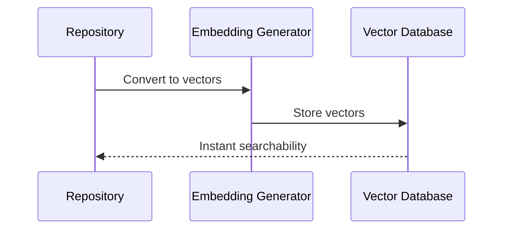

# Chapter 6: Pinecone Vector Management

In the [previous chapter about Embedding Transformation](05_embedding_transformation.md), we learned how to convert text into mathematical vectors. Now, let's explore how we store and manage these vectors intelligently with Pinecone Vector Management! 🗄️✨

## The Digital Librarian: Your Vector Storage Solution

Imagine you're a librarian with millions of books, but instead of physical shelves, you have a magical system that can instantly find the most relevant book just by understanding its content. That's exactly what Pinecone Vector Management does for digital information! 📚🔍

### What is Pinecone Vector Management?

Pinecone Vector Management is like a hyper-efficient, intelligent archive system for high-dimensional vectors. It allows you to:
- Store vector embeddings
- Organize them in namespaces
- Perform lightning-fast semantic searches
- Manage large-scale vector databases

## Real-World Use Case: Developer Knowledge Base

Let's solve a common problem: How can developers quickly find relevant code snippets across multiple repositories?

### The Magic of Vector Management

```python
def store_repository_vectors(repository_url, config, env_vars):
    # Clone and process repository
    repo_name = extract_repo_name(repository_url)
    repo_path = clone_or_update_repo(repository_url)
    content_chunks = process_repository(repo_path)
    
    # Initialize embedding function
    embedding_function = get_embedding_function(config, env_vars)
    embedding_dimension = config.get("pinecone", {}).get("dimension", 384)
    
    # Generate embeddings
    chunks_with_embeddings = embed_chunks(content_chunks, embedding_function, embedding_dimension)
    vectors = prepare_vectors_for_upsert(chunks_with_embeddings)
    
    # Initialize Pinecone
    pinecone_client = init_pinecone(
        api_key=env_vars["PINECONE_API_KEY"],
        environment=env_vars["PINECONE_ENVIRONMENT"]
    )
    
    # Ensure index exists
    index_name = config.get("pinecone", {}).get("index_name", f"{repo_name.lower()}-repo")
    metric = config.get("pinecone", {}).get("metric", "cosine")
    index = ensure_index_exists(pinecone_client, index_name, embedding_dimension, metric)
    
    # Store in Pinecone with appropriate namespace
    namespace = get_namespace_for_repo(repo_name)
    results = upsert_vectors(index, vectors, namespace)
    
    return results
```

This function demonstrates the complete vector management process:
- Processes a repository
- Converts content to embeddings
- Initializes Pinecone with proper configuration
- Creates or ensures an index exists
- Stores vectors in a repository-specific namespace
- Returns detailed results of the operation

## How Pinecone Vector Management Works

Let's visualize the vector storage process:



## Key Concepts: Namespaces and Indexing

### Namespaces: Your Organizational Superpowers

Namespaces are like labeled folders in a filing cabinet. They help you:
- Organize vectors by project
- Separate different types of content
- Perform targeted searches

```python
# Creating namespaces
ml_index.upsert(vectors, namespace="machine-learning")
web_index.upsert(vectors, namespace="web-content")
```

### Vector Indexing: Lightning-Fast Search

Pinecone creates an optimized index that allows super-fast semantic searches. It's like having a magic search engine that understands meaning, not just keywords!

## Practical Example: Finding Similar Code

```python
def find_similar_code(query_code, index, namespace, embedding_function, top_k=5):
    # Generate embedding for query
    query_embedding = embedding_function(query_code)
    
    # Search Pinecone index
    search_results = index.query(
        vector=query_embedding,
        top_k=top_k,
        namespace=namespace,
        include_metadata=True
    )
    
    # Process and return results
    similar_snippets = []
    for match in search_results.matches:
        similar_snippets.append({
            "score": match.score,
            "text": match.metadata.get("text", ""),
            "file_path": match.metadata.get("file_path", ""),
            "repository": match.metadata.get("repository_name", "")
        })
    
    return similar_snippets
```

This function demonstrates a more realistic implementation that:
- Converts a code snippet to a vector using the provided embedding function
- Searches the specified index and namespace
- Processes the search results to extract relevant metadata
- Returns structured results with similarity scores and context

## Behind the Scenes: Implementation Details

Our implementation in `repo_ingestion/pinecone/index_manager.py` handles complex vector management with several key functions:

```python
# Initialize Pinecone client with GRPC support
def init_pinecone(api_key: str, environment: str):
    # Initialize Pinecone client using GRPC (newer SDK version)
    pc = PineconeGRPC(api_key=api_key)
    return pc

# Ensure index exists or create it
def ensure_index_exists(client, index_name: str, dimension: int, metric: str):
    # Check if index already exists
    existing_indexes = [index.name for index in client.list_indexes()]
    
    if index_name not in existing_indexes:
        # Create new serverless index
        client.create_index(
            name=index_name,
            dimension=dimension,
            metric=metric,
            spec=ServerlessSpec(cloud="aws", region="us-west-2")
        )
    
    # Return index object
    return client.Index(index_name)

# Prepare vectors for upserting
def prepare_vectors_for_upsert(chunks_with_embeddings):
    vectors = []
    for chunk in chunks_with_embeddings:
        # Generate unique ID
        vector_id = generate_vector_id(prefix=chunk.get("metadata", {}).get("file_path", ""))
        
        # Prepare vector with metadata
        vector = {
            "id": vector_id,
            "values": chunk["embedding"],
            "metadata": chunk.get("metadata", {})
        }
        vectors.append(vector)
    return vectors

# Upsert vectors in batches
def upsert_vectors(index, vectors, namespace, batch_size=100):
    total_vectors = len(vectors)
    total_upserted = 0
    
    # Process in batches
    for i in range(0, total_vectors, batch_size):
        batch = vectors[i:i+batch_size]
        index.upsert(vectors=batch, namespace=namespace)
        total_upserted += len(batch)
    
    return {"total_upserted": total_upserted}
```

This implementation provides:

1. Robust Pinecone client initialization with GRPC support
2. Automatic index creation with serverless architecture
3. Proper vector preparation with unique IDs and metadata
4. Efficient batch processing for vector upserting
5. Namespace management for organizing vectors

## Key Takeaways

- Pinecone Vector Management turns complex vector storage into a simple process
- Namespaces help organize your vector collections
- You can perform lightning-fast semantic searches

## What's Next?

Ready to learn how to configure and customize your vector management? Let's explore [Configuration Management](07_configuration_management.md)!

## Related ADRs

- [ADR-0002: Pinecone Serverless Architecture with GRPC Client](adr/0002-pinecone-serverless-architecture.md) - This ADR documents the decision to use Pinecone's serverless architecture with GRPC client, explaining the benefits in terms of scalability, performance, and operational efficiency. It provides important architectural context for our vector database implementation.
- [ADR-0003: Metadata Size Management Strategy](adr/0003-metadata-size-management.md) - This ADR addresses how we handle Pinecone's 40KB metadata size limit, which is critical for ensuring all vectors can be successfully stored with their associated metadata.

---

Generated by [AI Codebase Knowledge Builder](https://github.com/The-Pocket/Tutorial-Codebase-Knowledge)