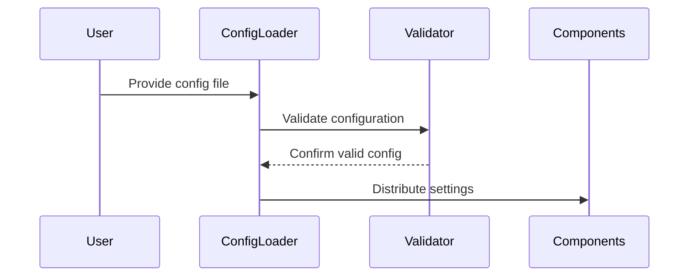

# Chapter 7: Configuration Management

In the [previous chapter about Pinecone Vector Management](06_pinecone_vector_management.md), we learned how to store and manage vector embeddings. Now, let's explore the blueprint architect of our system: Configuration Management! 🏗️🔧

## The System's Master Plan

Imagine you're building a complex machine with many intricate parts. How do you ensure all these parts work together seamlessly? That's exactly what Configuration Management does for our repository processing system!

### What is Configuration Management?

Think of Configuration Management like a master conductor of an orchestra, carefully coordinating how each instrument (or in our case, system component) should play. It defines settings, validates critical environment variables, and provides a single source of truth for your entire application.

## The Configuration Challenge: Solving Real-World Complexity

Consider a scenario: You're building a tool to process multiple repositories with different embedding models, search strategies, and web crawling configurations. How do you manage all these settings without creating a tangled mess of code?

### A Simple Configuration Solution

```yaml
# config.yaml
pinecone:
  dimension: 384
  metric: cosine
  index_name: "repository-knowledge"

embedding:
  model: "multilingual-e5-large"

firecrawl:
  max_urls: 20
  deep_research:
    enabled: true
    max_depth: 3
    max_urls: 10

repomix:
  max_files: 100
  excluded_paths:
    - "node_modules/"
    - "__pycache__/"
    - "*.test.js"
```

This configuration file allows you to:
- Set vector database parameters including dimension and similarity metric
- Choose embedding models for text vectorization
- Configure Firecrawl web crawling and deep research settings
- Control repository processing limits and exclusions

## How Configuration Management Works

Let's visualize the configuration loading process:



## Key Configuration Components

1. **Environment Variable Validation**
   Ensures critical API keys and settings are present

2. **YAML Configuration Loading**
   Reads settings from a human-readable file

3. **Nested Configuration Access**
   Provides flexible ways to retrieve specific settings

## Practical Implementation

Here's the actual configuration loader implementation from our codebase:

```python
# Required configuration keys that must be present
REQUIRED_CONFIG_KEYS = [
    "pinecone.dimension",
    "pinecone.metric",
    "embedding.model",
]

def load_config(config_path: str) -> Dict[str, Any]:
    """Load configuration from a YAML file."""
    try:
        with open(config_path, 'r') as f:
            config = yaml.safe_load(f)
        
        # Validate required configuration keys
        _validate_config(config)
        
        return config
    except FileNotFoundError:
        logger.error(f"Configuration file not found: {config_path}")
        raise
    except yaml.YAMLError as e:
        logger.error(f"Error parsing YAML configuration: {e}")
        raise

def _validate_config(config: Dict[str, Any]) -> None:
    """Validate that the configuration contains all required keys."""
    missing_keys = []
    
    for key_path in REQUIRED_CONFIG_KEYS:
        parts = key_path.split('.')
        current = config
        
        for part in parts:
            if not isinstance(current, dict) or part not in current:
                missing_keys.append(key_path)
                break
            current = current[part]
    
    if missing_keys:
        error_msg = f"Missing required configuration keys: {', '.join(missing_keys)}"
        logger.error(error_msg)
        raise ValueError(error_msg)

def get_nested_config(config: Dict[str, Any], key_path: str, default: Optional[Any] = None) -> Any:
    """Get a nested configuration value using dot notation."""
    parts = key_path.split('.')
    current = config
    
    for part in parts:
        if not isinstance(current, dict) or part not in current:
            return default
        current = current[part]
    
    return current
```

This implementation provides:
- Robust configuration loading with error handling
- Validation of required configuration keys
- Flexible nested configuration access with default values
- Type annotations for better code safety

## Real-World Configuration Scenarios

```python
# Example usage in our pipeline
config = load_config('config.yaml')

# Get embedding model configuration
embedding_model = get_nested_config(
    config, 
    'embedding.model', 
    default='multilingual-e5-large'
)

# Get Pinecone dimension for vector storage
dimension = get_nested_config(
    config, 
    'pinecone.dimension', 
    default=384
)

# Get Firecrawl deep research settings
deep_research_enabled = get_nested_config(
    config, 
    'firecrawl.deep_research.enabled', 
    default=False
)

max_depth = get_nested_config(
    config, 
    'firecrawl.deep_research.max_depth', 
    default=3
)
```

## Benefits of Configuration Management

- 🔧 Centralized settings management
- 🛡️ Environment variable validation
- 🌈 Flexible configuration options
- 💡 Easy customization without code changes

## Environment Variable Validation

In addition to configuration files, our system also validates required environment variables:

```python
# Required environment variables
REQUIRED_ENV_VARS = [
    "PINECONE_API_KEY",
    "PINECONE_ENVIRONMENT",
    "FIRECRAWL_API_KEY",
]

# Optional environment variables (required based on configuration)
OPTIONAL_ENV_VARS = [
    "EMBEDDING_API_KEY",
]

def validate_env_vars() -> Dict[str, str]:
    """Validate that all required environment variables are set."""
    # Try to load environment variables from .env file
    try:
        load_dotenv()
    except Exception as e:
        logger.warning(f"Error loading .env file: {e}")
    
    # Check required environment variables
    missing_vars = []
    env_vars = {}
    
    for var in REQUIRED_ENV_VARS:
        value = os.environ.get(var)
        if not value:
            missing_vars.append(var)
        else:
            env_vars[var] = value
    
    if missing_vars:
        error_msg = f"Missing required environment variables: {', '.join(missing_vars)}"
        logger.error(error_msg)
        raise ValueError(error_msg)
    
    # Check optional environment variables
    for var in OPTIONAL_ENV_VARS:
        value = os.environ.get(var)
        if value:
            env_vars[var] = value
    
    return env_vars
```

## Key Takeaways

Configuration Management transforms complex system settings into a simple, manageable blueprint. By using YAML files and smart loading techniques, we can create highly flexible and easy-to-configure applications.

Ready to learn how we ensure the quality of our processed data? Let's explore [Validation and Quality Assurance](08_validation_and_quality_assurance.md)!

## Related ADRs

- [ADR-0002: Pinecone Serverless Architecture](adr/0002-pinecone-serverless-architecture.md) - This ADR explains the choice of Pinecone's serverless architecture, which influences configuration settings for vector storage.
- [ADR-0003: Metadata Size Management](adr/0003-metadata-size-management.md) - This ADR details strategies for managing metadata size limits, which are controlled through configuration settings.

---

Generated by [AI Codebase Knowledge Builder](https://github.com/The-Pocket/Tutorial-Codebase-Knowledge)