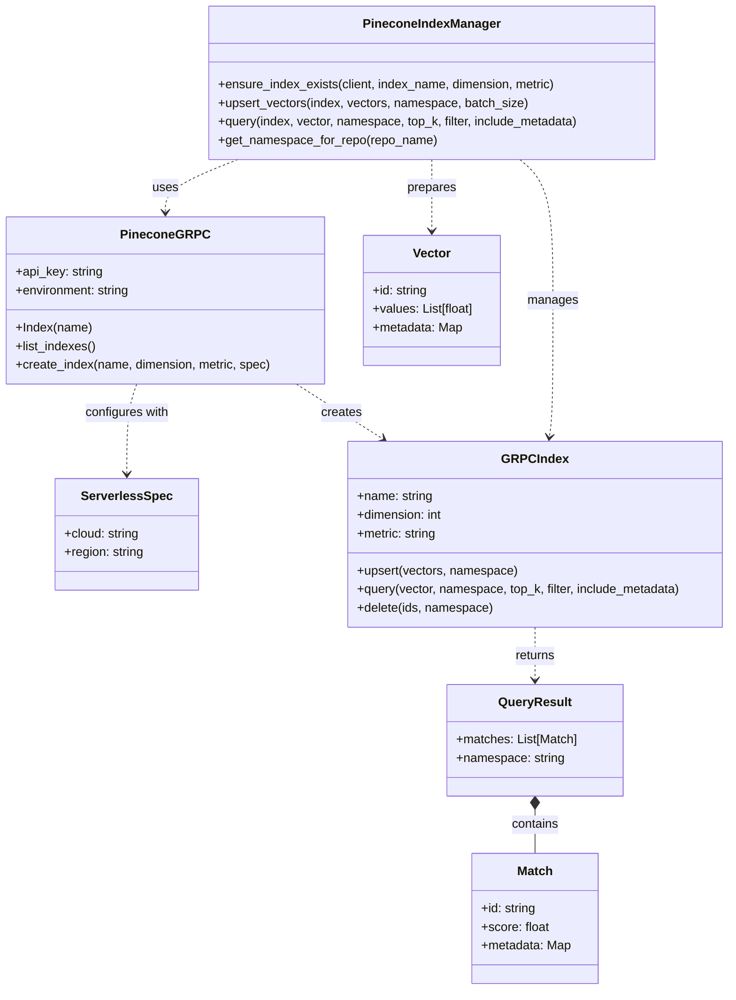

# Pinecone Serverless Architecture with GRPC Client

## Status
Accepted

## Context
The project requires an efficient and scalable vector database solution for storing and retrieving embeddings generated from repository content and web data. The previous implementation used a standard Pinecone index, which required manual provisioning and management of resources.

Key challenges with the previous approach included:
- Manual scaling to handle varying workloads
- Operational overhead for index management
- Limited performance for high-throughput operations
- Complexity in managing connections and retries

## Domain Model

The following diagram illustrates the domain model for the Pinecone serverless architecture integration, showing the key concepts and their relationships:

This domain model defines clear boundaries between the index management layer, the Pinecone GRPC client, and the data structures used for vector operations. It establishes a consistent vocabulary for discussing vector storage and retrieval operations across the codebase.

## Decision
We decided to implement Pinecone's serverless architecture using the GRPC client. This involved:

1. Updating the index_manager.py to use PineconeGRPC client instead of the standard REST client
2. Configuring the index with ServerlessSpec
3. Implementing proper error handling and retry mechanisms for GRPC connections
4. Optimizing query and upsert operations for the GRPC protocol

The implementation follows our team's "Understanding the System" principle by ensuring a comprehensive understanding of Pinecone's serverless architecture and GRPC protocol before making changes.

## Consequences

### Positive
- Improved scalability with automatic scaling based on workload
- Reduced operational overhead with no need to manage index resources
- Better performance through the more efficient GRPC protocol
- More reliable connections with built-in retry mechanisms
- Cost efficiency with usage-based pricing model

### Negative
- Increased complexity in the client code to handle GRPC specifics
- Dependency on Pinecone's serverless offering and its limitations
- Potential learning curve for team members unfamiliar with GRPC
- Some features might not be immediately available in the serverless offering

## Alternatives Considered

1. **Continue with standard Pinecone indexes**: We could have continued using the standard Pinecone indexes with manual provisioning. This would have been simpler but would not address the scalability and operational overhead issues.

2. **Use a different vector database**: We considered alternatives like Milvus, Qdrant, or Weaviate. While these offer good features, Pinecone's performance characteristics and serverless offering best matched our requirements for vector search.

3. **Build a custom scaling solution**: We could have built a custom solution to manage multiple Pinecone indexes and implement our own load balancing. This would have given us more control but would have required significant development effort and ongoing maintenance.

4. **Use the REST API with serverless**: We considered using Pinecone's REST API with the serverless offering instead of GRPC. While this would have been simpler to implement, it would not provide the performance benefits of GRPC, especially for high-throughput operations.
