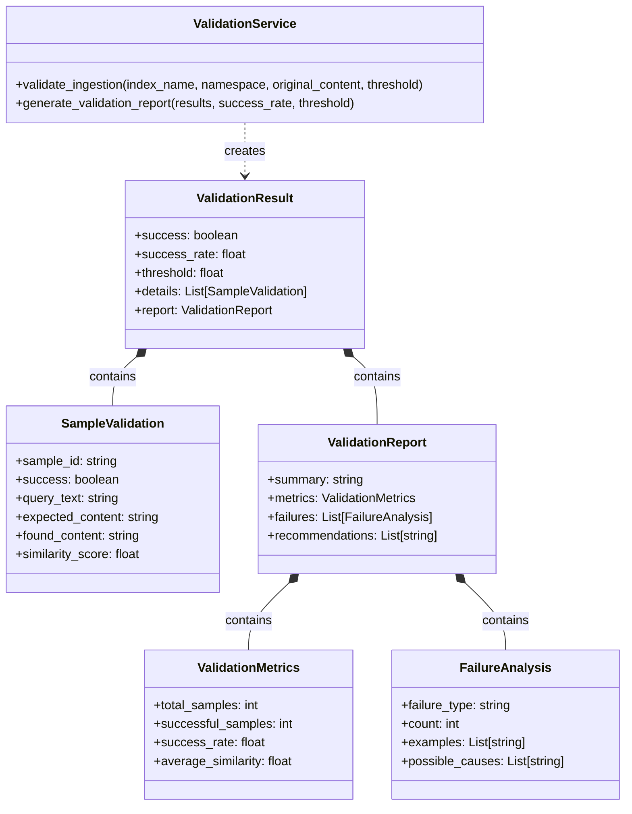

# Content Validation Framework

## Status
Accepted

## Context
The reliability and quality of data ingested into the Pinecone vector database are critical for ensuring accurate search results. During implementation, we encountered several challenges:

1. No systematic way to verify successful content ingestion
2. Difficulty identifying and diagnosing ingestion failures
3. Lack of metrics to measure ingestion success rates
4. Inconsistent file path extraction leading to duplicate or missing content
5. No standardized reporting mechanism for ingestion results

These issues made it difficult to ensure the completeness and accuracy of the data in the Pinecone index, potentially affecting search quality and user experience.

## Domain Model

The following diagram illustrates the domain model for the validation framework, showing the key concepts and their relationships:



The domain model defines clear boundaries between the validation service, validation results, and reporting components. It establishes a consistent vocabulary for discussing validation concepts across the codebase.

## Decision
We decided to implement a comprehensive validation framework with the following features:

1. A validation step to verify content ingestion with a 60% success threshold
2. Enhanced file path extraction using regex pattern matching
3. Detailed validation reporting with metrics and failure analysis
4. Automated validation after ingestion processes
5. Clear success criteria and failure handling

The implementation follows our team's "Make It Fail" and "Quit Thinking and Look" principles by establishing concrete validation criteria and collecting factual data about system behavior rather than relying on assumptions.

Key components of the validation framework include:

```python
def validate_ingestion(index_name, namespace, original_content, threshold=0.6):
    """
    Validate that content was successfully ingested into Pinecone.
    
    Args:
        index_name: Name of the Pinecone index
        namespace: Namespace in the index
        original_content: List of original content items
        threshold: Success threshold (default: 0.6)
        
    Returns:
        ValidationResult object with metrics and details
    """
    # Query index for sample content
    validation_results = []
    for sample in get_validation_samples(original_content):
        result = validate_sample(index_name, namespace, sample)
        validation_results.append(result)
    
    # Calculate success rate
    success_rate = sum(1 for r in validation_results if r.success) / len(validation_results)
    
    # Generate detailed report
    report = generate_validation_report(validation_results, success_rate, threshold)
    
    # Return validation result
    return ValidationResult(
        success=(success_rate >= threshold),
        success_rate=success_rate,
        threshold=threshold,
        details=validation_results,
        report=report
    )
```

## Consequences

### Positive
- Improved confidence in data quality and completeness
- Early detection of ingestion issues
- Quantifiable metrics for ingestion success
- Better debugging capabilities through detailed reporting
- More reliable file path extraction and content identification

### Negative
- Additional processing overhead for validation steps
- Potential false negatives in validation (content exists but not found)
- Added complexity to the ingestion pipeline
- Need to maintain and update validation criteria as the system evolves
- 60% threshold may need adjustment based on real-world performance

## Alternatives Considered

1. **Manual spot-checking**: We considered relying on manual verification of sample content. This would be simpler but not scalable or reliable for large repositories.

2. **100% validation**: Another option was to validate every single piece of content. This would provide complete verification but would be prohibitively expensive in terms of processing time and API calls.

3. **Post-ingestion data analysis**: We considered implementing a separate analysis process to run after ingestion. This would separate concerns but would delay detection of issues.

4. **Client-side validation only**: We considered validating only on the client side before sending to Pinecone. This would catch formatting issues but wouldn't verify successful storage and retrieval.
