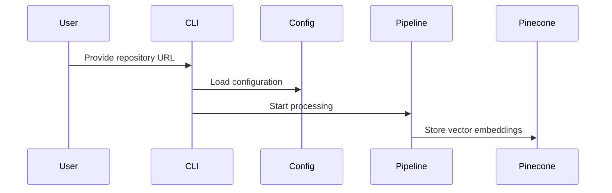

# Command Line Interface

Imagine you have a complex machine with many buttons and settings, but you want a simple, intuitive way to control it. That's exactly what a Command Line Interface (CLI) does for our repository ingestion system!

## What is a Command Line Interface?

A CLI is like a powerful remote control for your software. Instead of clicking through multiple screens, you can type simple commands that tell the program exactly what you want to do. In our `pinecone-mcp-helper` project, the CLI is your gateway to processing repositories, extracting information, and storing it in Pinecone.

## Why Use a CLI?

Let's consider a real-world scenario: You want to take a GitHub repository about machine learning and convert its contents into searchable vector embeddings. Without a CLI, this would be a complicated, multi-step process. With our CLI, it becomes as simple as typing one command!

## Basic CLI Usage

Here's a simple example of how you might use our CLI:

```bash
python main.py https://github.com/username/ml-project --log-level DEBUG --config custom_config.yaml
```

This command tells our program to:
- Process the repository at the given URL
- Set logging to show detailed debug information
- Use a custom configuration file

### CLI Arguments Explained

Our CLI supports several helpful arguments:

1. `repo_url`: The main target - your repository's URL or path to a local Git repository
2. `--config`: Custom configuration file (optional, default: config.yaml)
3. `--log-level`: Control how much information you see (DEBUG, INFO, WARNING, ERROR, CRITICAL)
4. `--no-firecrawl`: Skip web URL extraction and processing
5. `--no-deep-research`: Disable deep research on extracted topics
6. `--search-query`: Specify a search query for Firecrawl and deep research (overrides automatic topic extraction)
7. `--mock-mode`: Test the system without making real API calls
8. `--log-file`: Path to a log file (if not provided, logs will only be written to the console)

## How It Works Behind the Scenes

Let's peek inside the CLI's inner workings with a simple sequence diagram:



## Code Walkthrough

The magic happens in our `cli.py` file. Here's a simplified view of the argument parsing:

```python
def parse_args(args=None):
    parser = argparse.ArgumentParser(
        description="Ingest Git repository content and associated web links into a Pinecone vector database."
    )
    
    parser.add_argument(
        "repo_url",
        help="URL of the Git repository to ingest or path to a local Git repository."
    )
    
    parser.add_argument(
        "--config",
        default="config.yaml",
        help="Path to the YAML configuration file. Default: config.yaml"
    )
    
    parser.add_argument(
        "--log-level",
        default="INFO",
        choices=["DEBUG", "INFO", "WARNING", "ERROR", "CRITICAL"],
        help="Set the logging level. Default: INFO"
    )
    
    # More arguments including no-firecrawl, no-deep-research, search-query, mock-mode, and log-file
    
    return parser.parse_args(args)
```

This function creates a parser that understands the commands and options a user might provide. The actual implementation includes additional arguments for controlling Firecrawl integration, deep research, and logging options.

## Key Takeaways

- CLIs provide a powerful, flexible way to interact with complex systems
- Our CLI makes repository processing simple and configurable
- You can control the ingestion process with just a few arguments

## What's Next?

Now that you understand the Command Line Interface, let's explore how it integrates with our repository processing pipeline in [Pipeline Integration](02_pipeline_integration.md).

## Related ADRs

- [ADR-0001: Use Firecrawl SDK](adr/0001-use-firecrawl-sdk.md) - This ADR explains the decision to use the Firecrawl SDK instead of direct MCP functions, which impacts how the CLI handles Firecrawl-related arguments like `--no-firecrawl` and `--search-query`.

---

Generated by [AI Codebase Knowledge Builder](https://github.com/The-Pocket/Tutorial-Codebase-Knowledge)