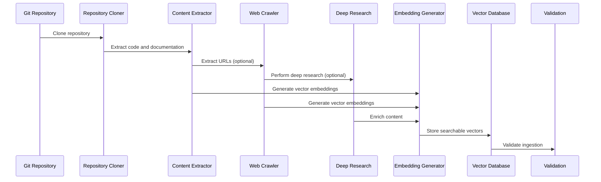

# Chapter 2: Pipeline Integration

In the [previous chapter about the Command Line Interface](01_command_line_interface.md), we learned how to interact with our tool using simple commands. Now, let's dive into the heart of our system: the Pipeline Integration.

## The Pipeline: Your Content Processing Maestro 🎼

Imagine you're a conductor leading an orchestra, but instead of musicians, you have different software components working together to transform raw code into searchable knowledge. That's exactly what our pipeline does!

### What is a Pipeline?

A pipeline is like a sophisticated assembly line for processing repositories. It takes a raw GitHub repository and transforms it through multiple stages:

1. Clone the repository
2. Extract content
3. Analyze repository structure
4. Generate embeddings
5. Index in Pinecone
6. Optionally crawl related web content

## Real-World Scenario: Developer Knowledge Base

Let's consider a practical example. You're building a knowledge base for a machine learning team, and you want to make all your repositories searchable.

### Pipeline Workflow



## Pipeline Implementation Overview

Here's a more comprehensive representation of how our pipeline works:

```python
def run_pipeline(args, config, env_vars):
    # Step 1: Clone or update repository
    repo_url = args.repo_url
    repo_name = extract_repo_name(repo_url)
    repo_path = clone_or_update_repo(repo_url)
    
    # Step 2: Execute Repomix and process output
    repomix_output_path = execute_repomix(repo_path)
    repo_chunks = parse_repomix_output(repomix_output_path)
    
    # Step 3: Initialize embedding function
    embedding_function = get_embedding_function(config, env_vars)
    
    # Step 4: Initialize Pinecone client and ensure index exists
    pinecone_client = init_pinecone(env_vars["PINECONE_API_KEY"], env_vars["PINECONE_ENVIRONMENT"])
    index_name = get_nested_config(config, "pinecone.index_name", f"{repo_name.lower()}-repo")
    index = ensure_index_exists(pinecone_client, index_name, embedding_dimension, metric)
    
    # Step 5: Embed and upsert repository content
    repo_chunks_with_embeddings = embed_chunks(repo_chunks, embedding_function, embedding_dimension)
    repo_vectors = prepare_vectors_for_upsert(repo_chunks_with_embeddings)
    namespace = get_namespace_for_repo(repo_name)
    repo_upsert_results = upsert_vectors(index, repo_vectors, namespace)
    
    # Steps 6-9: Firecrawl processing (if enabled)
    if not args.no_firecrawl:
        firecrawl_client = init_firecrawl(env_vars["FIRECRAWL_API_KEY"])
        
        if args.search_query:
            # Use Firecrawl search
            firecrawl_results = search_web_content(firecrawl_client, args.search_query)
        else:
            # Extract and process URLs
            urls = extract_urls_from_repomix_output(repomix_output_path)
            firecrawl_results = scrape_urls(firecrawl_client, urls)
            
        firecrawl_chunks = process_firecrawl_results(firecrawl_results)
        
        # Step 10: Deep research (if enabled)
        if not args.no_deep_research and config["firecrawl"]["deep_research"]["enabled"]:
            # Perform deep research and enrich content
            research_topics = args.search_query or extract_research_topics(repo_chunks)
            research_results = perform_deep_research(research_topics)
            enriched_chunks = enrich_content_with_research(repo_chunks, research_results)
            
            # Embed and upsert enriched content
            enriched_chunks_with_embeddings = embed_chunks(enriched_chunks, embedding_function)
            enriched_vectors = prepare_vectors_for_upsert(enriched_chunks_with_embeddings)
            upsert_vectors(index, enriched_vectors, f"{namespace}-enriched")
    
        # Step 11: Embed and upsert Firecrawl content
        if firecrawl_chunks:
            firecrawl_chunks_with_embeddings = embed_chunks(firecrawl_chunks, embedding_function)
            firecrawl_vectors = prepare_vectors_for_upsert(firecrawl_chunks_with_embeddings)
            firecrawl_upsert_results = upsert_vectors(index, firecrawl_vectors, namespace)
    
    # Step 12: Validate repository ingestion
    validation_results = validate_repository_ingestion(index, namespace, repo_path, repomix_output_path)
    
    # Step 13: Report results
    return results_summary
```

This function demonstrates the complete pipeline stages:
- Clone the repository
- Extract meaningful content
- Initialize embedding and Pinecone
- Process repository content
- Optionally process web content via Firecrawl
- Optionally perform deep research
- Validate the ingestion process
- Report comprehensive results

### Key Pipeline Components

1. **Repository Cloning**: Retrieves the latest code or updates local repository
2. **Content Extraction**: Uses Repomix to find relevant files and extract meaningful content
3. **Web Content Processing**: Optionally extracts URLs and crawls related web content
4. **Deep Research**: Optionally performs in-depth research on key topics to enrich content
5. **Embedding Generation**: Converts text to vector representations using configurable models
6. **Vector Indexing**: Stores vectors in Pinecone for semantic search
7. **Validation**: Verifies that ingested content is properly searchable
8. **Results Reporting**: Provides comprehensive metrics on the ingestion process

## Behind the Scenes: Configuration and Flexibility

The pipeline isn't just a rigid process. It's configurable through a YAML file:

```yaml
pipeline:
  max_file_size: 100KB
  excluded_paths:
    - "*.test.js"
    - "node_modules/"
  embedding_model: "openai/text-embedding-ada-002"
```

This configuration allows you to:
- Limit file sizes
- Exclude unnecessary files
- Choose embedding models

## Error Handling and Logging

Our pipeline includes robust error handling:

```python
try:
    results = run_pipeline(repository_url)
    logger.info(f"Successfully processed {results['total_chunks']} chunks")
except PipelineError as e:
    logger.error(f"Pipeline processing failed: {e}")
```

## Key Takeaways

- Pipelines transform complex processing into simple, manageable steps
- Each stage of the pipeline has a specific, focused role
- Configurations provide flexibility without complexity

## What's Next?

Ready to see how we integrate external web crawling? Let's explore [Firecrawl Integration](03_firecrawl_integration.md) in the next chapter!

## Related ADRs

- [ADR-0001: Use Firecrawl SDK](adr/0001-use-firecrawl-sdk.md) - This ADR documents the decision to use the Firecrawl SDK for web content extraction, which is a key component of our pipeline.
- [ADR-0002: Pinecone Serverless Architecture](adr/0002-pinecone-serverless-architecture.md) - This ADR explains the choice of Pinecone's serverless architecture for vector storage, which impacts how our pipeline interacts with the vector database.
- [ADR-0004: Repomix Processor Improvements](adr/0004-repomix-processor-improvements.md) - This ADR details improvements to the Repomix processor, which is central to our content extraction pipeline stage.

---

Generated by [AI Codebase Knowledge Builder](https://github.com/The-Pocket/Tutorial-Codebase-Knowledge)