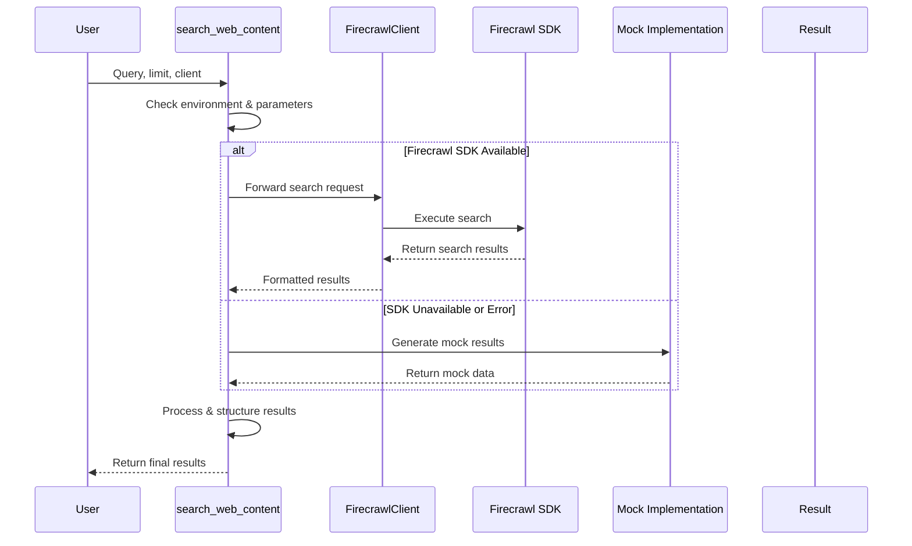

# Firecrawl Integration

In the [previous chapter about Pipeline Integration](/pipeline/), we learned how to process repository content systematically. Now, let's explore an exciting capability that transforms our tool from a simple repository processor into an intelligent web researcher: Firecrawl Integration!

## The Web Research Challenge 🕵️‍♀️

Imagine you're a developer working on a machine learning project. You have a repository with some initial code, but you want to enrich your research with real-world web content. How do you automatically gather relevant information without manually browsing the internet?

Enter Firecrawl Integration: your automated web research assistant! 🚀

## What is Firecrawl Integration?

Firecrawl is like having a super-smart research intern who can:
- Search the web based on your project's context
- Extract meaningful content from websites
- Provide deep, contextual information
- Transform unstructured web data into structured knowledge

### Key Capabilities

1. **Web Search**: Find relevant web content automatically
2. **Content Extraction**: Pull meaningful text from websites
3. **Deep Research**: Generate comprehensive insights
4. **Metadata Enrichment**: Add context to your research

## Solving a Real-World Problem: Research Automation

Let's walk through a concrete example. Suppose you're developing a machine learning library about natural language processing (NLP). You want to automatically gather the latest research and best practices.

### The Magic of Automatic Web Research

```python
# Import the required modules
from repo_ingestion.firecrawl.crawler import init_firecrawl
from repo_ingestion.firecrawl.search import search_web_content

# Initialize the Firecrawl client with your API key
firecrawl_client = init_firecrawl(api_key="YOUR_FIRECRAWL_API_KEY")

# Automatically research NLP topics
research_results = search_web_content(
    firecrawl_client=firecrawl_client,
    query="latest NLP techniques",
    limit=5,  # Get top 5 results
    scrape_results=True  # Extract content from search results
)

# Now you have curated web content!
for result in research_results:
    print(f"Title: {result['title']}")
    print(f"URL: {result['url']}")
    print(f"Content snippet: {result['content'][:100]}...")
```

> **Note**: The above example shows the proper initialization and usage of the Firecrawl client. The actual implementation includes robust error handling and fallback mechanisms.

When you run this code, Firecrawl does the heavy lifting:
- Searches the web for NLP content
- Extracts meaningful text
- Provides structured results

## How Firecrawl Works: Behind the Scenes

Let's peek into the magical process with a sequence diagram:



> **Note**: This diagram shows the actual flow including fallback mechanisms and error handling, which are critical parts of our robust implementation.

## Deep Dive: Code Implementation

Let's explore the core implementation in [`repo_ingestion/firecrawl/search.py`](https://github.com/decision-crafters/pinecone-mcp-helper/blob/main/repo_ingestion/firecrawl/search.py) and [`repo_ingestion/firecrawl/crawler.py`](https://github.com/decision-crafters/pinecone-mcp-helper/blob/main/repo_ingestion/firecrawl/crawler.py):

```python
# Actual implementation in repo_ingestion/firecrawl/search.py
def search_web_content(
    firecrawl_client: Any,
    query: str,
    limit: int = 20,
    scrape_results: bool = True,
    mock_mode: bool = False
) -> List[Dict[str, Any]]:
    """Search for web content related to a query using Firecrawl.
    Falls back to a mock implementation if Firecrawl search is not available.
    """
    try:
        logger.info(f"Searching for web content with query: '{query}'")
        
        # If in mock mode, skip trying real implementation
        if mock_mode:
            logger.info("Mock mode enabled, skipping real Firecrawl search implementation")
            raise ImportError("Mock mode enabled")
        
        # Check if Firecrawl API key is available
        import os
        firecrawl_api_key = os.environ.get('FIRECRAWL_API_KEY')
        if not firecrawl_api_key:
            logger.warning("FIRECRAWL_API_KEY not found in environment variables")
            logger.info("Falling back to mock implementation due to missing API key")
            raise ImportError("FIRECRAWL_API_KEY not available")
        
        # Set up scrape options if needed
        scrape_options = {
            "formats": ["markdown"],
            "onlyMainContent": True,
            "waitFor": 1000  # Wait 1 second for dynamic content
        } if scrape_results else None
        
        # Use FirecrawlClient instance or other compatible client
        from repo_ingestion.firecrawl.crawler import FirecrawlClient
        
        if isinstance(firecrawl_client, FirecrawlClient):
            search_results = firecrawl_client.search(
                query=query,
                limit=limit,
                scrapeOptions=scrape_options
            )
            
            # Process search results
            results = []
            for result in search_results.get("results", []):
                results.append({
                    "url": result.get("url", ""),
                    "title": result.get("title", ""),
                    "content": result.get("content", {}).get("markdown", ""),
                    "source_type": "web_search",
                    "metadata": {
                        "api_used": "firecrawl",
                        "query": query
                    }
                })
            
            return results
            
    except Exception as e:
        # Fall back to mock implementation
        logger.warning(f"Error during Firecrawl search: {e}")
        logger.info("Falling back to mock implementation")
        
        # Create mock search results based on the query
        mock_results = [
            # Mock result generation code omitted for brevity
        ]
        
        return mock_results
```

> **Note**: The actual implementation is more complex with additional error handling, multiple client type support, and a robust mock implementation for testing. This example has been simplified while preserving the key architectural patterns.

This function:
- Initializes a Firecrawl client
- Searches the web
- Structures the results
- Handles potential errors gracefully

## Advanced Features: Deep Research

Beyond simple search, Firecrawl offers deep research capabilities:

```python
# Import the deep research function
from repo_ingestion.firecrawl.crawler import perform_deep_research

# Perform deep research on a topic with detailed parameters
async def research_ml_trends():
    deep_research_results = await perform_deep_research(
        topics=["machine learning trends"],
        max_depth=3,  # How deep to explore related topics
        max_urls=10   # Maximum URLs to analyze per topic
    )
    
    # Process the comprehensive research results
    for topic, results in deep_research_results.items():
        print(f"Research on {topic}:")
        for result in results:
            print(f"- {result['title']}")
            print(f"  Source: {result['url']}")
```

> **Note**: The `perform_deep_research` function is asynchronous, allowing for efficient parallel processing of multiple research topics.

This method:
- Explores multiple web sources
- Analyzes content at different depths
- Provides comprehensive insights

## Practical Use Cases

Firecrawl Integration is perfect for:

- **Academic research automation**: Gather papers and research findings automatically
- **Tech trend tracking**: Stay updated on emerging technologies and industry shifts
- **Competitive intelligence**: Monitor competitors' products, features, and market positioning
- **Content recommendation systems**: Enhance recommendations with fresh web content
- **Documentation enrichment**: Supplement internal documentation with external references
- **Knowledge base construction**: Build comprehensive knowledge bases from diverse sources

### FirecrawlClient Class

The core of our implementation is the `FirecrawlClient` class, which provides:

- **SDK Integration**: Seamless integration with the Firecrawl SDK when available
- **Fallback Mechanisms**: Graceful degradation to mock implementations when needed
- **Error Handling**: Robust error handling for network issues and API failures
- **Flexible Configuration**: Support for various search and scraping options

## Conclusion

Firecrawl Integration transforms our repository processing tool into an intelligent web research assistant. By automatically searching, extracting, and structuring web content, we can enrich our projects with minimal manual effort.

Ready to see how we process these repositories systematically? Let's move on to [Repository Processing](04_repository_processing.md)!

## Related ADRs

- [ADR-0001: Use Firecrawl SDK Instead of MCP Functions](adr/0001-use-firecrawl-sdk.md) - This ADR documents the decision to use the Firecrawl SDK instead of MCP functions, explaining the benefits in terms of reliability, maintainability, and error handling. It provides important context for understanding the implementation choices in our Firecrawl integration.

---

Generated by [AI Codebase Knowledge Builder](https://github.com/The-Pocket/Tutorial-Codebase-Knowledge)