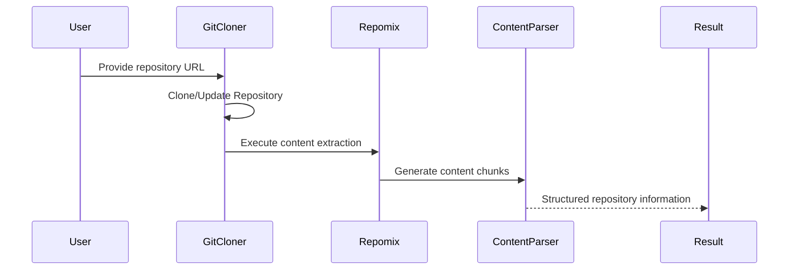

# Chapter 4: Repository Processing

In the [previous chapter about Firecrawl Integration](03_firecrawl_integration.md), we explored how to gather web content automatically. Now, let's dive into the heart of our system: Repository Processing! 🕵️‍♀️🔍

## The Digital Archaeology Challenge

Imagine you're a researcher with hundreds of code repositories scattered across different platforms. How do you systematically explore and extract meaningful information from them? That's exactly what Repository Processing helps you do!

## What is Repository Processing?

Repository Processing is like being a digital archaeologist who carefully excavates code repositories. Instead of digging through physical layers of earth, we're exploring layers of code, documentation, and project structure.

### Key Capabilities

Repository Processing allows you to:
- Clone repositories automatically
- Extract meaningful content
- Understand project structure
- Prepare information for further analysis

## A Real-World Scenario: Open Source Research

Let's say you're a machine learning researcher studying different AI project implementations. You want to:
- Automatically download repositories
- Extract code snippets
- Analyze project structures
- Prepare content for embedding and searching

### How Repository Processing Helps

```python
from repo_ingestion.git import clone_or_update_repo
from repo_ingestion.repomix import execute_repomix, parse_repomix_output

def process_repository(repo_url):
    # Step 1: Clone or update repository
    repo_path = clone_or_update_repo(repo_url)
    
    # Step 2: Extract repository content
    repomix_output = execute_repomix(repo_path)
    
    # Step 3: Parse extracted content
    content_chunks = parse_repomix_output(repomix_output)
    
    return content_chunks
```

This simple function does multiple complex tasks:
- Retrieves the repository
- Extracts its content
- Prepares it for further processing

## Behind the Scenes: Processing Workflow

Let's visualize the repository processing steps:



## Handling Different Repository Types

Repository Processing is flexible and can handle various scenarios:

1. Public GitHub repositories
2. Local Git repositories
3. Repositories from different version control systems

## Error Handling and Robustness

```python
def safe_repository_processing(repo_url):
    try:
        content_chunks = process_repository(repo_url)
        print(f"Processed {len(content_chunks)} content chunks")
    except Exception as e:
        print(f"Error processing repository: {e}")
        # Gracefully handle errors
```

This approach ensures that even if something goes wrong, your system remains stable.

## Key Files and Implementation

Our implementation spans two main files:
- `repo_ingestion/git/repo_manager.py`: Handles repository cloning
- `repo_ingestion/repomix/processor.py`: Processes repository content

## Advanced Features

Repository Processing can also:
- Extract URLs from repository content
- Generate repository summaries
- Support multiple programming languages

## Practical Considerations

When using Repository Processing, consider:
- Repository size limits
- Processing time for large repositories
- Handling private repositories

## What Have We Learned?

Repository Processing transforms raw code repositories into structured, searchable information. It's like turning a messy library into a well-organized knowledge base!

Ready to see how we transform this content into vector embeddings? Let's explore [Embedding Transformation](05_embedding_transformation.md) in the next chapter!

## Related ADRs

- [ADR-0004: Repomix Processor Improvements](adr/0004-repomix-processor-improvements.md) - This ADR documents the decision to enhance the Repomix processor for better content extraction, improved performance, and more robust error handling. It provides important context for understanding how we process repository content efficiently.

---

Generated by [AI Codebase Knowledge Builder](https://github.com/The-Pocket/Tutorial-Codebase-Knowledge)