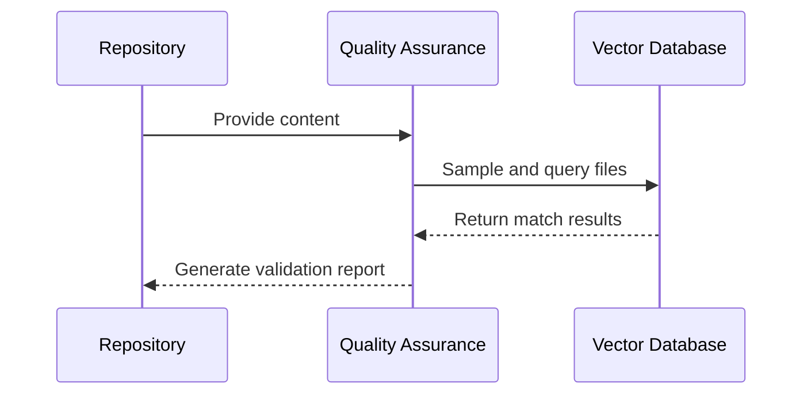

# Chapter 8: Validation and Quality Assurance

In the [previous chapter about Configuration Management](07_configuration_management.md), we learned how to set up flexible system settings. Now, let's explore the guardian of our system: Validation and Quality Assurance! 🕵️‍♀️🔍

## The Digital Quality Inspector

Imagine you're a quality control manager in a factory, but instead of checking physical products, you're ensuring the integrity of digital knowledge. That's exactly what Validation and Quality Assurance does for our repository processing system!

### What is Validation and Quality Assurance?

Think of validation like a meticulous librarian who carefully checks every book before adding it to the library's catalog. In our system, this means systematically verifying that repository content has been correctly processed, indexed, and is searchable.

## The Validation Challenge: Ensuring Reliable Knowledge

Consider a scenario: You've processed multiple repositories into a searchable knowledge base. How can you be confident that ALL the content was correctly ingested and is retrievable?

### Validation Implementation

```python
def validate_repository_ingestion(
    index, 
    namespace: str, 
    repo_path: str, 
    repomix_output_path: str,
    embedding_dimension: int = 384
) -> Dict[str, Any]:
    """Validate that repository content has been properly ingested into Pinecone."""
    # Extract file paths from Repomix output
    file_paths = extract_file_paths_from_repomix(repomix_output_path)
    
    # Select random file paths to validate (up to 5)
    sample_size = min(5, len(file_paths))
    sample_paths = random.sample(file_paths, sample_size)
    
    # Query Pinecone for each file path
    validation_results = []
    for file_path in sample_paths:
        try:
            # Create a dense vector for querying
            dense_vector = [0.1] * embedding_dimension
            
            # Query Pinecone using dense vector
            query_response = index.query(
                namespace=namespace,
                top_k=50,  # Get more results to increase chance of finding matches
                include_metadata=True,
                vector=dense_vector
            )
            
            # Check if any matches contain our file path
            found_match = check_matches_for_file_path(query_response.matches, file_path)
            
            if not found_match:
                # Try a second approach with a different dense vector
                dense_vector = [(0.2 if i % 2 == 0 else 0.3) for i in range(embedding_dimension)]
                query_response = index.query(
                    namespace=namespace,
                    top_k=100,
                    include_metadata=True,
                    vector=dense_vector
                )
                found_match = check_matches_for_file_path(query_response.matches, file_path)
            
            # Record the result
            if found_match:
                validation_results.append({
                    "file_path": file_path,
                    "found": True,
                    "match_field": found_match["field"],
                    "match_value": found_match["value"],
                    "score": found_match["score"]
                })
            else:
                validation_results.append({
                    "file_path": file_path,
                    "found": False
                })
        except Exception as e:
            validation_results.append({
                "file_path": file_path,
                "found": False,
                "error": str(e)
            })
    
    # Calculate validation success rate
    found_count = sum(1 for result in validation_results if result.get("found", False))
    success_rate = found_count / len(validation_results) if validation_results else 0
    
    return {
        "success": success_rate >= 0.6,  # Consider validation successful if >=60% of files are found
        "success_rate": success_rate,
        "found_count": found_count,
        "total_count": len(validation_results),
        "results": validation_results
    }
```

This function provides a robust validation approach that:
- Extracts file paths from the Repomix output
- Samples a subset of files for validation
- Uses multiple query strategies to find matches
- Provides detailed validation results with success metrics

## How Validation Works: A Step-by-Step Journey

Let's visualize the validation process:



## Key Validation Strategies

1. **Random Sampling**
   - Select a subset of repository files
   - Validate their presence in the vector database

2. **Metadata Verification**
   - Check file paths and content metadata
   - Ensure semantic meaning is preserved

3. **Confidence Scoring**
   - Calculate success rate of file retrieval
   - Provide a reliability metric

## Validation Strategy Details

Our validation implementation uses several sophisticated techniques to ensure robust verification:

```python
def extract_file_paths_from_repomix(repomix_output_path: str) -> List[str]:
    """Extract file paths from Repomix output XML file."""
    # Read the Repomix output file
    with open(repomix_output_path, 'r') as f:
        repomix_content = f.read()
    
    # Extract directory structure section
    if "<directory_structure>" in repomix_content:
        dir_structure = repomix_content.split("<directory_structure>")[1]
        dir_structure = dir_structure.strip()
    else:
        return []
    
    # Extract file paths using regex pattern matching
    file_paths = []
    file_path_pattern = re.compile(r'^[\w\-./]+\.[\w]+$')  # Simple pattern for file paths
    
    for line in dir_structure.split("\n"):
        line = line.strip()
        if not line or line.endswith("/"):
            continue
            
        # Clean the line and check if it looks like a file path
        clean_line = line.lstrip(" -")
        if file_path_pattern.match(clean_line) or "/" in clean_line:
            file_paths.append(clean_line)
    
    return file_paths

def check_matches_for_file_path(matches, file_path: str) -> Optional[Dict[str, Any]]:
    """Check if any matches contain the target file path in their metadata."""
    for match in matches:
        metadata = match.metadata if hasattr(match, 'metadata') else {}
        
        # Check all metadata fields for the file path
        for key, value in metadata.items():
            if isinstance(value, str) and (file_path in value or value in file_path):
                return {
                    "field": key,
                    "value": value,
                    "score": match.score if hasattr(match, 'score') else None
                }
    
    return None
```

These helper functions demonstrate our approach to:
- Extract file paths from structured repository data
- Perform intelligent matching against vector database results
- Handle various edge cases and potential errors

## Benefits of Validation

- 🛡️ Ensures data integrity
- 🔍 Provides confidence in search results
- 💡 Identifies potential indexing issues
- 🚀 Improves overall system reliability

## Real-World Implementation Details

Our implementation in `repo_ingestion/validation/validation.py` provides robust validation:
- Multiple query strategies
- Handling different repository types
- Flexible confidence thresholds

## Conclusion

Validation and Quality Assurance transforms our repository processing from a simple data ingestion tool into a reliable, trustworthy knowledge management system. By systematically checking our indexed content, we ensure high-quality, searchable information.

Ready to learn how we handle errors and log important events? Let's explore [Logging and Error Handling](09_logging_and_error_handling.md)!

## Related ADRs

- [ADR-0005: Validation Framework](adr/0005-validation-framework.md) - This ADR documents the decision to implement a comprehensive validation framework for ensuring data integrity throughout the ingestion pipeline. It explains our approach to validation strategies, confidence scoring, and quality assurance mechanisms that help maintain the reliability of our system.

---

Generated by [AI Codebase Knowledge Builder](https://github.com/The-Pocket/Tutorial-Codebase-Knowledge)