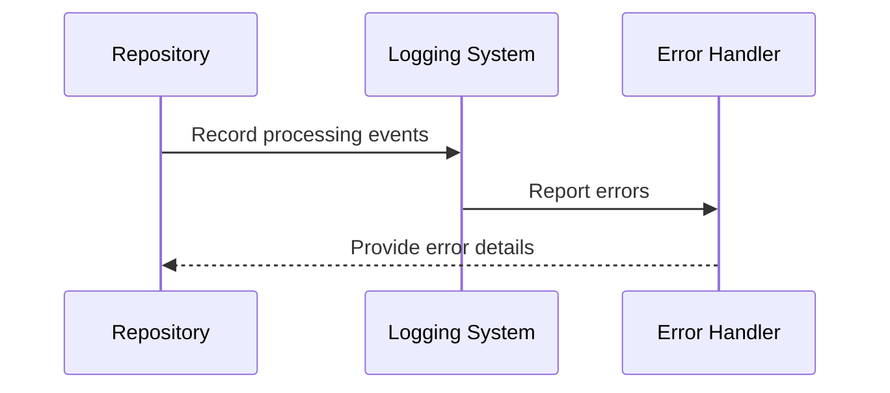

# Chapter 9: Logging and Error Handling

In the [previous chapter about Validation and Quality Assurance](08_validation_and_quality_assurance.md), we learned how to ensure our repository processing system's reliability. Now, let's explore the system's communication and resilience mechanism: Logging and Error Handling! 🕵️‍♀️🚨

## The System's Nervous System: Communication and Resilience

Imagine you're building a complex machine with many moving parts. How would you know what's happening inside when something goes wrong? That's exactly what Logging and Error Handling does for our repository processing system!

### What is Logging and Error Handling?

Think of logging and error handling like a detailed diary and a safety net for your software. It helps you:
- Track what's happening in your system
- Capture important events
- Diagnose problems when things don't go as planned
- Recover gracefully from unexpected issues

## The Real-World Challenge: Tracking Repository Processing

Consider this scenario: You're processing multiple repositories, and suddenly something unexpected happens. How can you understand what went wrong and where?

### A Simple Logging Solution

```python
def process_repository(repo_url):
    try:
        # Start processing
        logger.info(f"Starting repository processing: {repo_url}")
        
        # Process repository
        content_chunks = extract_repository_content(repo_url)
        
        # Log successful processing
        logger.info(f"Successfully processed {len(content_chunks)} chunks")
        
        return content_chunks
    
    except Exception as e:
        # Log the error
        logger.error(f"Error processing repository {repo_url}: {e}")
        
        # Optionally, raise a custom error
        raise RepositoryProcessingError(f"Failed to process {repo_url}") from e
```

This function helps you:
- Log the start of repository processing
- Track the number of processed chunks
- Capture and log any errors that occur

## How Logging Works: A Step-by-Step Journey

Let's visualize the logging process:



## Key Logging Strategies

1. **Informational Logging**
   - Track normal system operations
   - Provide insights into system behavior

2. **Error Logging**
   - Capture exceptions and unexpected behaviors
   - Include detailed error information

3. **Debug Logging**
   - Provide very detailed information
   - Useful during development and troubleshooting

## Practical Logging Implementation

```python
def setup_logging(log_level: str = "INFO", log_file: Optional[str] = None) -> None:
    """Set up logging for the application."""
    # Convert string log level to logging constant
    numeric_level = getattr(logging, log_level.upper(), None)
    if not isinstance(numeric_level, int):
        raise ValueError(f"Invalid log level: {log_level}")

    # Configure root logger
    root_logger = logging.getLogger()
    root_logger.setLevel(numeric_level)

    # Clear any existing handlers
    for handler in root_logger.handlers[:]:
        root_logger.removeHandler(handler)

    # Create console handler
    console_handler = logging.StreamHandler(sys.stdout)
    console_handler.setLevel(numeric_level)

    # Create formatter
    formatter = logging.Formatter(
        "%(asctime)s - %(name)s - %(levelname)s - %(message)s",
        datefmt="%Y-%m-%d %H:%M:%S"
    )
    console_handler.setFormatter(formatter)

    # Add console handler to root logger
    root_logger.addHandler(console_handler)

    # Add file handler if log_file is provided
    if log_file:
        file_handler = logging.FileHandler(log_file)
        file_handler.setLevel(numeric_level)
        file_handler.setFormatter(formatter)
        root_logger.addHandler(file_handler)

    # Suppress overly verbose logging from third-party libraries
    logging.getLogger("urllib3").setLevel(logging.WARNING)
    logging.getLogger("git").setLevel(logging.WARNING)
```

This implementation provides:
- Configurable log levels with validation
- Both console and file logging options
- Consistent formatting with timestamps
- Suppression of verbose third-party library logs
- Proper handler management to avoid duplicates

## Benefits of Logging and Error Handling

- 🔍 Provides system visibility
- 🛡️ Helps diagnose issues
- 💡 Supports troubleshooting
- 🚀 Improves system reliability

## Real-World Implementation Details

Our implementation in `repo_ingestion/utils/logging_utils.py` provides:
- Configurable log levels
- Console and file logging
- Custom formatting
- Third-party library log suppression

## Advanced Error Handling: Custom Exceptions

```python
class RepositoryProcessingError(Exception):
    """Custom exception for repository processing errors."""
    def __init__(self, message, details=None):
        super().__init__(message)
        self.details = details
```

This helps you:
- Create specific error types
- Include additional error context
- Improve error tracking and handling

## Using Logging in the Pipeline

Here's how our logging is used throughout the pipeline:

```python
# In the CLI module
def main() -> int:
    try:
        # Parse command-line arguments
        args = parse_args()
        
        # Set up environment with proper logging
        setup_logging(args.log_level, args.log_file)
        logger.info("Starting repository ingestion pipeline")
        logger.info(f"Repository URL: {args.repo_url}")
        
        # Run the pipeline
        results = run_pipeline(args, config, env_vars)
        
        # Log results
        logger.info("Pipeline completed successfully")
        logger.info(f"Repository: {results['repository']}")
        logger.info(f"Total vectors upserted: {results['total_vectors_upserted']}")
        
        return 0
    except Exception as e:
        logger.error(f"Error in repository ingestion pipeline: {e}")
        return 1
```

This approach ensures:
- Comprehensive logging throughout the application lifecycle
- Consistent error handling patterns
- Proper command-line argument integration
- Detailed success and error reporting

## Conclusion

Logging and Error Handling transforms our repository processing system from a black box into a transparent, resilient tool. By systematically tracking events and managing errors, we ensure a robust and debuggable application.

Each event and error becomes a breadcrumb, helping developers understand and improve the system. Whether it's tracking successful repository processing or capturing complex errors, logging is your system's voice.

Ready to see how this fits into the bigger picture? Keep exploring and building amazing tools! 🚀

## Related ADRs

- [ADR-0005: Validation Framework](adr/0005-validation-framework.md) - This ADR documents the decision to implement a comprehensive validation framework, which relies heavily on proper logging for error reporting and diagnostic information.

---

Generated by [AI Codebase Knowledge Builder](https://github.com/The-Pocket/Tutorial-Codebase-Knowledge)