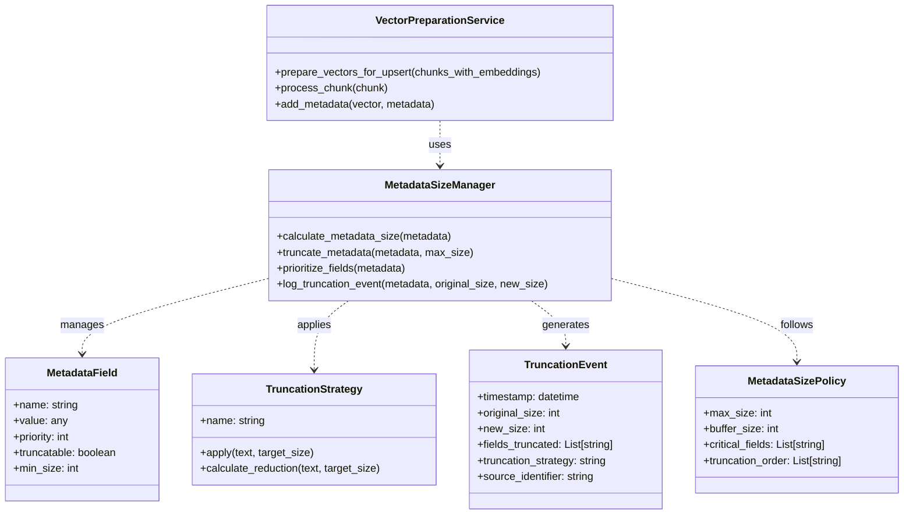

# Metadata Size Management Strategy

## Status
Accepted

## Context
Pinecone has a strict limit of 40KB for metadata size per vector. During our implementation, we encountered issues where some vectors had metadata exceeding this limit, causing upsert operations to fail. This was particularly problematic for:

1. Repository files with large content
2. Web content scraped from complex pages
3. Files with extensive metadata attributes

When metadata exceeded the 40KB limit, Pinecone would reject the vector, resulting in:
- Failed upsert operations
- Missing data in the index
- Inconsistent search results
- Error messages in logs

We needed a reliable strategy to ensure all vectors could be successfully stored in Pinecone while preserving as much useful metadata as possible.

## Domain Model

The following diagram illustrates the domain model for the metadata size management strategy, showing the key concepts and their relationships:



This domain model defines clear boundaries between the metadata management components, the truncation strategies, and the vector preparation service. It establishes a consistent vocabulary for discussing metadata size management across the codebase.

## Decision
We decided to implement a metadata truncation strategy that:

1. Detects when metadata is approaching the 40KB limit
2. Intelligently truncates text fields based on priority
3. Preserves critical metadata fields (like file paths, URLs, and source types)
4. Logs truncation events for monitoring

The implementation includes:

```python
def prepare_vectors_for_upsert(chunks_with_embeddings):
    # ...
    for chunk in chunks_with_embeddings:
        # Calculate metadata size
        metadata_size = calculate_metadata_size(chunk['metadata'])
        
        # If approaching limit, truncate text fields
        if metadata_size > 35000:  # Buffer before 40KB limit
            chunk['metadata']['text'] = truncate_text(
                chunk['metadata']['text'], 
                target_size=metadata_size - 35000
            )
            logger.info(f"Truncated text for {chunk['metadata'].get('file_path', 'unknown')} to fit metadata size limit")
    # ...
```

This approach follows our team's "Divide and Conquer" principle by breaking down the problem into manageable components and addressing the specific issue of metadata size without affecting other aspects of the system.

## Consequences

### Positive
- All vectors can now be successfully stored in Pinecone
- Critical metadata fields are preserved
- The system is more robust against varying content sizes
- Improved reliability of the ingestion pipeline
- Better monitoring through logging of truncation events

### Negative
- Some text content is truncated, potentially losing valuable information
- Additional processing overhead during vector preparation
- Complexity added to the vector preparation code
- Need for monitoring to ensure truncation doesn't affect search quality

## Alternatives Considered

1. **Reject oversized vectors**: We could have simply rejected vectors with metadata exceeding the limit. This would have been simpler but would result in missing data and incomplete search results.

2. **Split large vectors**: We considered splitting vectors with large metadata into multiple smaller vectors. This would preserve all content but would complicate retrieval and potentially affect search relevance.

3. **Compress metadata**: Another option was to compress metadata before storage and decompress after retrieval. This would preserve all data but add complexity and processing overhead.

4. **Store large content externally**: We considered storing large text content in an external storage system (like S3) and including only references in Pinecone metadata. This would avoid size limits but complicate the retrieval process and add dependencies.
