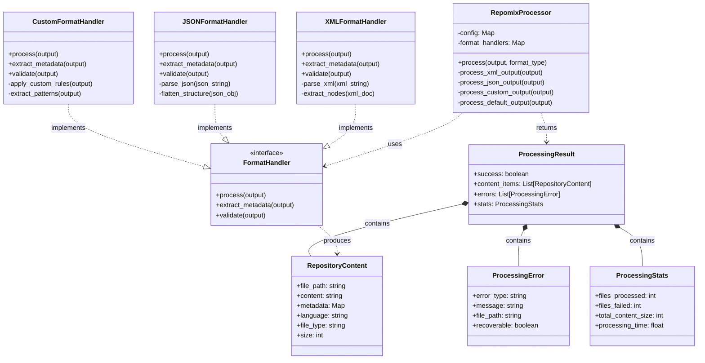

# Repomix Processor Improvements

## Status
Accepted

## Context
The project uses Repomix to process repository content for ingestion into the Pinecone vector database. However, the initial implementation had several limitations when dealing with custom output formats:

1. Inconsistent handling of different file types and structures
2. Limited extraction of metadata from repository files
3. Difficulty processing non-standard file formats and structures
4. Inefficient parsing of large repositories
5. Challenges with extracting meaningful content from complex code structures

These limitations affected the quality and completeness of the data ingested into Pinecone, ultimately impacting search relevance and user experience.

## Domain Model

The following diagram illustrates the domain model for the Repomix processor improvements, showing the key concepts and their relationships:



This domain model defines clear boundaries between the processor, format handlers, and the content entities. It establishes a consistent vocabulary for discussing repository content processing across the codebase and enables a more flexible and extensible approach to handling different output formats.

## Decision
We decided to improve the Repomix processor to better handle custom output formats. The improvements include:

1. Enhanced parsing logic to handle a wider range of file formats
2. Better extraction of metadata from repository files
3. Improved handling of custom output formats through configurable processors
4. More robust error handling for malformed or unexpected outputs
5. Optimized processing for large repositories

The implementation follows our team's "Understanding the System" principle by ensuring a comprehensive understanding of Repomix's capabilities and limitations before making changes. We also adhered to the "Divide and Conquer" principle by breaking down the processing logic into smaller, more manageable components.

Key code changes included:

```python
class RepomixProcessor:
    def __init__(self, config):
        self.config = config
        self.format_handlers = {
            'xml': self._process_xml_output,
            'json': self._process_json_output,
            'custom': self._process_custom_output
        }
    
    def process(self, output, format_type):
        handler = self.format_handlers.get(format_type, self._process_default_output)
        return handler(output)
    
    def _process_custom_output(self, output):
        # Enhanced logic for custom output formats
        # ...
```

## Consequences

### Positive
- Better handling of diverse repository content
- More complete and accurate metadata extraction
- Improved search relevance due to better content processing
- More robust error handling and logging
- Easier extension for new file types and formats

### Negative
- Increased complexity in the Repomix processor code
- Additional configuration options to manage
- Potential performance impact for very large repositories
- Need for more comprehensive testing across different repository types

## Alternatives Considered

1. **Custom pre-processing step**: We considered adding a custom pre-processing step before using Repomix. This would have allowed us to normalize inputs but would have added an extra step to the pipeline and potentially duplicated functionality.

2. **Post-processing Repomix output**: Another option was to accept Repomix's standard output and apply transformations afterward. This would have been simpler but less efficient and might have lost information during the initial processing.

3. **Replace Repomix with a custom solution**: We considered developing a completely custom repository processing solution. This would have given us full control but would have required significant development effort and ongoing maintenance.

4. **Use language-specific parsers**: We also considered using dedicated parsers for each programming language or file type. This would have provided more accurate parsing but would have significantly increased complexity and dependencies.
