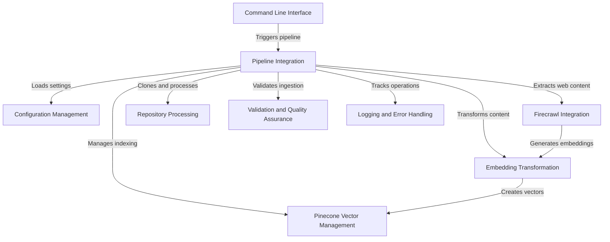

# Tutorial: pinecone-mcp-helper

**Pinecone MCP Helper** is an intelligent *repository ingestion pipeline* that transforms code and web content into searchable vector databases. It automates the process of extracting, embedding, and indexing content from Git repositories and web sources, enabling powerful semantic search and research capabilities using Pinecone's vector database technology.

**Source Repository:** [https://github.com/decision-crafters/pinecone-mcp-helper.git](https://github.com/decision-crafters/pinecone-mcp-helper.git)

## Chapters

1. [Command Line Interface](01_command_line_interface.md)
2. [Pipeline Integration](02_pipeline_integration.md)
3. [Firecrawl Integration](03_firecrawl_integration.md)
4. [Repository Processing](04_repository_processing.md)
5. [Embedding Transformation](05_embedding_transformation.md)
6. [Pinecone Vector Management](06_pinecone_vector_management.md)
7. [Configuration Management](07_configuration_management.md)
8. [Validation and Quality Assurance](08_validation_and_quality_assurance.md)
9. [Logging and Error Handling](09_logging_and_error_handling.md)
10. [Real-World Examples](10_real_world_examples.md)

---

Generated by [AI Codebase Knowledge Builder](https://github.com/The-Pocket/Tutorial-Codebase-Knowledge)