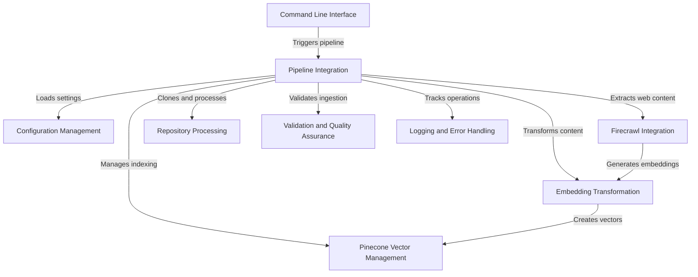

# Pinecone MCP Helper
{: .fs-9 }

An intelligent repository ingestion pipeline that transforms code and web content into searchable vector databases.
{: .fs-6 .fw-300 }

[Get started now](#getting-started){: .btn .btn-primary .fs-5 .mb-4 .mb-md-0 .mr-2 }
[View it on GitHub](https://github.com/decision-crafters/pinecone-mcp-helper){: .btn .fs-5 .mb-4 .mb-md-0 }

---

## Overview

**Pinecone MCP Helper** is an intelligent repository ingestion pipeline that transforms code and web content into searchable vector databases. It automates the process of extracting, embedding, and indexing content from Git repositories and web sources, enabling powerful semantic search and research capabilities using Pinecone's vector database technology.

**Source Repository:** [https://github.com/decision-crafters/pinecone-mcp-helper.git](https://github.com/decision-crafters/pinecone-mcp-helper.git)

## Getting Started
{: #getting-started }

To get started with Pinecone MCP Helper, follow these steps:

1. Install the package
2. Configure your Pinecone API key
3. Run your first ingestion pipeline

## Documentation Sections

Browse through our documentation to learn more about specific features and capabilities:

1. [Command Line Interface](01_command_line_interface.html)
2. [Pipeline Integration](02_pipeline_integration.html)
3. [Firecrawl Integration](03_firecrawl_integration.html)
4. [Repository Processing](04_repository_processing.html)
5. [Embedding Transformation](05_embedding_transformation.html)
6. [Pinecone Vector Management](06_pinecone_vector_management.html)
7. [Configuration Management](07_configuration_management.html)
8. [Validation and Quality Assurance](08_validation_and_quality_assurance.html)
9. [Logging and Error Handling](09_logging_and_error_handling.html)
10. [Real-World Examples](10_real_world_examples.html)

---

Generated by [AI Codebase Knowledge Builder](https://github.com/The-Pocket/Tutorial-Codebase-Knowledge)